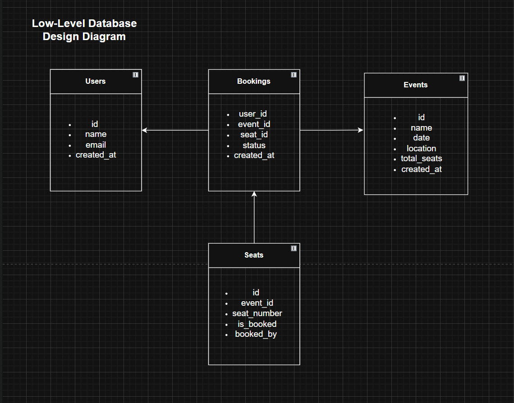
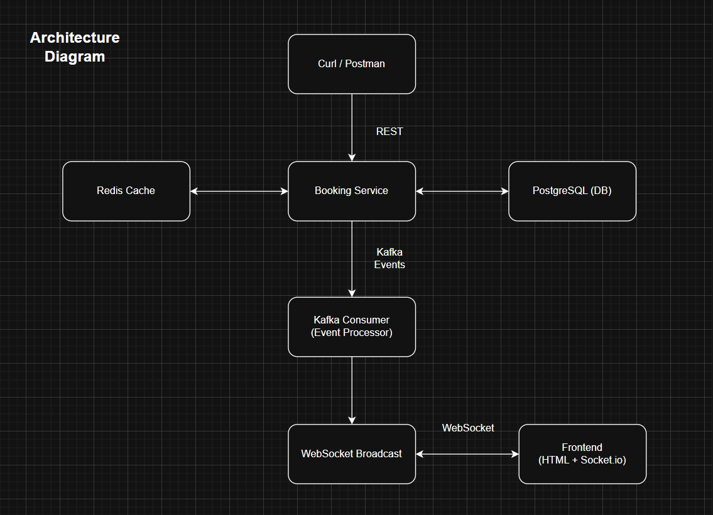

# 🎟️ Ticket Booking System - README

## ✅ Overview
A microservice-based, real-time ticket booking system designed to handle high concurrency , providing fair, first-come-first-serve seat allocation for events such as concerts or conferences.

---

## 1️⃣ Low-Level Database Design Diagram

The system uses PostgreSQL for structured booking data with proper relationships and indexes to ensure high performance.

- Tables:
  - `users(id, name, email, created_at)`
  - `events(id, name, date, location, total_seats, created_at)`
  - `seats(id, event_id, seat_number, is_booked, booked_by)`
  - `bookings(id, user_id, event_id, seat_id, status, created_at)`

- Indexes:
  - `seats(event_id, seat_number)` → for seat lookup
  - `bookings(user_id)` → for user-specific fetches

📷 **Diagram:**
 <!-- Replace with your actual image path -->

---

## 2️⃣ Queueing Mechanism for First-Come-First-Serve Booking

The system ensures FCFS fairness using:

- **Redis-based locking:**
  - Before attempting a DB transaction, a Redis key lock is applied (e.g., `event:1:seat:A1`).
  - If the key exists, the seat is already being processed → user receives "already booked" error.

- **Transactional Booking:**
  - PostgreSQL transaction ensures the seat is marked booked + booking is created atomically.

- **Kafka:**
  - Handles async updates after booking is complete.
  - Ensures booking process stays fast and non-blocking.

---

## 3️⃣ Real-Time Seat Availability Updates

The system provides real-time UI updates through:

- **Redis:**
  - Seat availability is stored as key-value pairs.

- **WebSocket (Socket.IO):**
  - When a booking or cancellation happens, a Kafka event is emitted.
  - The Kafka consumer listens and broadcasts the seat update to all connected clients.

- **Frontend:**
  - Socket.IO client receives updates and visually reflects booked or available seats instantly.

---

## 4️⃣ Scalability & Resilience Strategy

- **Scalability:**
  - API and WebSocket services can be horizontally scaled.
  - Redis handles fast seat lookups to reduce DB load.
  - Kafka allows decoupling heavy workloads like notifications and UI updates.
  - PostgreSQL connection pooling optimizes DB performance.

- **Resilience:**
  - Redis: If unavailable, falls back to DB (less performant).
  - Kafka: Supports retries, fault-tolerant message delivery.
  - Booking: DB transactions protect data integrity.
  - Docker + Kubernetes: Allows for resilient container orchestration (optional).

---

## 5️⃣ System Design Documentation

📷 **Architecture Diagram:**
 <!-- Replace with your image -->

### 🔸 Design Highlights:
- Microservice-oriented (API server, Kafka consumer)
- Clear separation of concerns
- Realtime updates via event-driven architecture
- Redis cache + transactional DB write

### 🔸 Failure Handling:
- Redis is used for performance, not persistence
- Kafka ensures async operations won’t block core booking logic
- Errors in one system (e.g. WebSocket) don’t affect others

### 🔸 Scalability Strategy:
- Stateless API allows horizontal scaling
- Redis + Kafka reduce bottlenecks
- WebSocket events use Socket.IO rooms for per-event broadcasting

---

## 🧰 Try it Out & Useful cURL Commands

> 💡 Please note: Due to resource constraints on the Raspberry Pi 5, **no stress testing or high-volume concurrency testing is requested**.

The app is publicly accessible via a secure **Cloudflare ZeroTrust tunnel** at:

🔗 **https://tbs.watevr.co.in/**

### Updated cURL Commands

### Book a Ticket:
```bash
curl -X POST https://tbs.watevr.co.in/api/bookings/book \
  -H "Content-Type: application/json" \
  -d '{
    "userId": 1,
    "eventId": 1,
    "seatNumber": "A1"
}'
```

### Cancel a Booking:
```bash
curl -X DELETE https://tbs.watevr.co.in/api/bookings/cancel/123
```

### Fetch User Bookings:
```bash
curl https://tbs.watevr.co.in/api/bookings/user/1
```

---

## 🐳 Dockerization & Deployment

### Version Control & Manual Deployment:
- GitHub is used for source code version control.
- Due to time constraints, a CI/CD pipeline has not been set up.
- The application is deployed manually using:

```bash
git pull origin main
sudo docker-compose up --build -d
```
The application is fully Dockerized and runs on a **Raspberry Pi 5**, utilizing the following services:

- **Redis**, **PostgreSQL**, and **Kafka** are all running as separate Docker containers.
- The application (Express API + WebSocket + Kafka consumer) is Dockerized and runs in containers as well.
- All configurations (database URL, Kafka broker, Redis host, etc.) are managed through a shared `.env` file.

- Redis, PostgreSQL, and Kafka are running as Docker containers on the same Raspberry Pi 5 server.
- The application reads service endpoints from a shared `.env` file.
- Publicly exposed via Cloudflare ZeroTrust at: [https://tbs.watevr.co.in](https://tbs.watevr.co.in)

---

## 🧪 Testing

- Jest is used for unit testing of all BookingService methods.
- Redis, Kafka, and PostgreSQL interactions are mocked using `jest.mock()`.
- Kafka producers and Redis clients are stubbed to avoid real connections.

### Run tests:
```bash
npm run test
```

---

## 🚀 Future Enhancements

- Currently, the system uses a mix of REST APIs and Kafka events.
- A full migration to a **truly event-driven architecture** is planned, where:
  - All state changes (e.g., seat updates, booking actions) will be Kafka-driven.
  - Each microservice will react to Kafka topics instead of synchronous REST calls.

### Additional Planned Features:
- Rate limiting and schema validation using libraries like **Zod** or **Joi**
- GitHub Actions-based CI/CD pipeline for auto-testing and deployment
- Admin dashboard for managing events and seats
- Email/SMS notifications
- Payment gateway integration (e.g., Stripe, Razorpay)

---


## ✅ Conclusion
You now have a fully containerized, real-time ticket booking system that's scalable, fault-tolerant, and production ready!